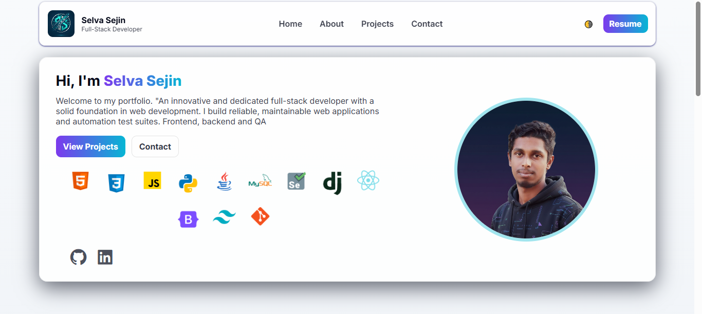

# 🌐 Personal Portfolio Website

This is my personal portfolio website showcasing my projects, skills, and professional profile as a Full-Stack Developer.

It is designed to be clean, responsive, and recruiter-friendly.

---

## 👨‍💻 About Me

Hi, I'm **Selva Sejin**, a Full-Stack Developer with experience in building web applications and automation test suites.

I specialize in:
- Frontend: HTML, CSS, JavaScript, React
- Backend: Python, Django, Java
- Database: MySQL
- Testing: Selenium (Manual & Automation)
- Tools: Git & GitHub

---

## 🚀 Live Demo

👉 [View Portfolio](https://selvasejin.github.io/personal-portfolio/)

---

## 📸 Preview

---

## 🛠️ Tech Stack

- HTML5
- CSS3
- JavaScript (ES6+)
- Python
- Django
- MySQL
- Selenium
- Git & GitHub

---

## ✨ Features

- Responsive design (Mobile & Desktop)
- Light/Dark theme toggle
- Smooth scrolling navigation
- Floating skill icons
- Project showcase section
- Contact form integration

---

